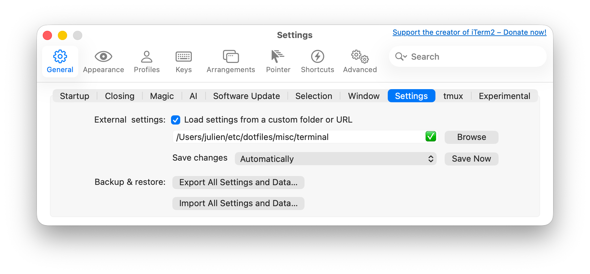

# Julien’s dotfiles


```
❯ ./dot.sh
Usage:
./dot.sh [--dry-run] [--dotfiles] [--sublime] [--macos|--macos-export|--macos-diff]

Options:
   -d | --dotfiles    Symlink dotfiles in home/ directory
   --sublime          Symlink Sublime Text preferences
   --macos            Apply macOS defaults from macos/defaults.yaml
   --macos-export     Read current system values, rewrite macos/defaults.yaml
   --macos-diff       Show keys where the manifest and system disagree
   -n | --dry-run     Print what would be linked without touching the filesystem
```

### Install Homebrew

```shell
curl -fsSL https://raw.githubusercontent.com/Homebrew/install/HEAD/install.sh
```

### Setup fish prompt

```shell
brew install fish

brew update fish
brew install fisher
brew install terminal-notifier

fisher install IlanCosman/tide@v6
fisher install franciscolourenco/done
fisher install jethrokuan/z

tide configure --auto --style=Lean --prompt_colors='16 colors' --show_time='24-hour format' --lean_prompt_height='Two lines' --prompt_connection=Disconnected --prompt_spacing=Sparse --icons='Many icons' --transient=No

# if docker
#docker completion fish > ~/.config/fish/completions/docker.fish
```

Install Nerd Font: [MesloLGS NF](https://github.com/ryanoasis/nerd-fonts/tree/master/patched-fonts/Meslo/S)

### Brewfile

Brace yourself

```shell
brew bundle install --global
```

### Bash as Login Shell

```sh
echo $SHELL
echo /opt/homebrew/bin/bash | sudo tee -a /etc/shells
chsh -s /opt/homebrew/bin/bash
```

### Link configuration

`./dot --dotfiles` can be executed anytime.

Configure iTerm to use `misc/terminal`.



### macOS defaults

System preferences (Finder, Dock, Trackpad, screensaver lock, menu bar clock,
…) are managed declaratively in `macos/defaults.yaml`. Every entry carries its
`defaults(1)` type so the same manifest can be both read and written.

Requires [`yq`](https://github.com/mikefarah/yq) (v4+): `brew install yq`.

```shell
./dot.sh --macos          # apply the manifest to this machine
./dot.sh --macos-diff     # show keys where the manifest and system disagree
./dot.sh --macos-export   # read current system values, rewrite the manifest
```

`macos/defaults.sh` is standalone — it can be run directly with
`./macos/defaults.sh {apply|export|diff}`.

`--macos-export` only refreshes keys that are **already listed** in the
manifest. To add a new setting, edit `defaults.yaml` by hand first, then
re-export to capture its current value. This avoids accidentally dumping
entire domains like `com.apple.dock` (which embeds machine-specific
`persistent-apps` binary blobs).

### 1password-cli (ssh-agent)

...

### TouchID for root password

Use TouchID to _sudo_ instead of password.
Source: https://davidwalsh.name/touch-sudo

```sh
# Open the sudo utility
sudo vi /etc/pam.d/sudo

# Add the following as the first line
auth sufficient pam_tid.so
```


```diff
# sudo: auth account password session
+ auth       sufficient     pam_tid.so
auth       sufficient     pam_smartcard.so
auth       required       pam_opendirectory.so
account    required       pam_permit.so
password   required       pam_deny.so
session    required       pam_permit.so
```


## Thanks to…

* [@mathiasbynens](https://github.com/mathiasbynens/dotfiles/) ([compare](https://github.com/mathiasbynens/dotfiles/compare/d6ca39a907123c0a7f874c500ba16cabb3156a63...master))
* [@paulmillr](https://github.com/paulmillr/dotfiles/) ([for vim config](https://github.com/paulmillr/vimrc/tree/5b472316d099fc1f6626ca790e81f6d021747c13))
* [@statico](https://github.com/statico/dotfiles/)
